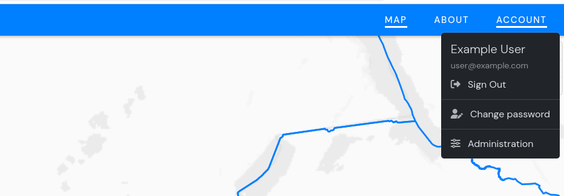
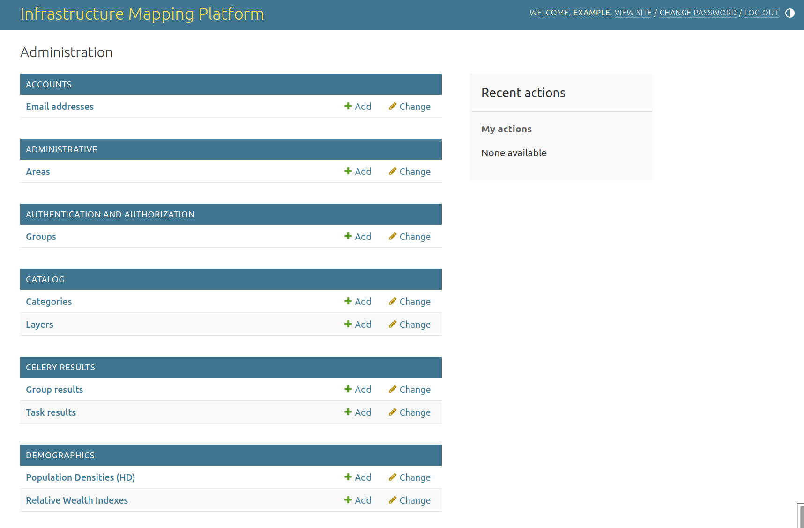

Admin User Guide
================

IIPdash offers an administration interface which is a powerful tool for managing data in the platform.
The admin portal is only accessible by some users with administrative privileges.

The interface can be used for various operations including
- Users management
- Viewing and filtering various records
- Importing and Exporting records
- Editing records
- Deleting records
- and more.

Accessing the Interface
-----------------------

To access the admin portal
1. Login to the platform using your account credentials.
2. Click the  "Administration" sub-menu located within the "Account" menu item of the main top menu.

When you are in the home page of the admin portal you will see various sections or data modules that
you can manage, such as Users, Demographics, Administrative areas, e.t.c.
Clicking on a module/section will take you to a list of records in that module.

Managing Users
--------------
The "Users" section allows you to manage user accounts.

Typically this can be used for tasks like.
- Viewing a list of users: See all registered users, their usernames, email addresses, and active status.
- Adding new users.
- Editing user's information such as name and email addresses.
- Managing users permissions: Example staff/admin and superuser status.
- Deleting users.

The ``Users`` index page displays a list of users.

Adding users
____________

To create user via the admin portal

1. Click the "Add user" button located at the top of the users page or the "Add" located near the Users link.
2. Enter the username, password and password confirmation for the user to be created and then save.
3. You will be redirected to the page for adding or editing more user details, including email, name
   and staff status. Optionally add some details like email, first name, last name then save.
4. **ONLY** if you want the newly created user to create/edit other users, in the step above, scroll to "User permissions",
   then scroll to the bottom of the User Permissions box, where you will find 4 options starting with "Users | user...".
   Double click each of them to add them to the user permission box on the right.

The platform stores the passwords in encrypted format, therefore the users passwords can't be
accessed as plain text.

Managing Users Passwords
________________________
There is no way to see the users' passwords after they are saved.
If the admin would like to change a password they may use the "reset password" link in a user's page.
Alternatively users may change or reset their own passwords by using the password reset link available
in the login page or using the change password sub-menu in the account menu.

Managing Data
--------------

The data in the admin portal is organized into modules/models.

To view a list of records of the specific module just click on the module/model link.

Most models will allow you to filter the list of returned results to help you find specific information.

Common filtering options include:
 - Search: Enter keywords to find records that contain specific text.
 - Date filters: Filter records by date (e.g., created today, this month, last year).
 - Filter by categories or other predefined options.

When the filters are applied, only records matching the filtering criteria will be included in
the displayed record listing.

To view more details of a specific record, click on its link in the list.
This will display a page with data fields and information associated with that record.

While viewing a record, you'll usually most of the fields will be editable.
To edit a record, you can edit the fields as needed and then save your changes.

Deleting Records
----------------
**Warning:** Be careful when deleting records because this action is irreversible.

To delete a specific record you will need to open the details page for that specific record, ad click a
delete button on that page. You will be asked to confirm if you are sure that you want to delete
a particular record and if you confirm the record will be deleted.

To delete multiple records at once you can
1. select the records that need to be deleted using checkboxes in the record listing of a specific model.
2. In the "action" dropdown at the top of the page select "delete selected ..." and Go.
3. Confirm deletion.

Importing and Exporting data
----------------------------
The admin portal provides a way to easily import and export data in various formats,
which can be very useful for tasks like downloading data for additional external/independent analysis,
updating information in bulk or backing up the data.

If the import/export feature is available for a model, you'll typically see "Import" and "Export"
buttons when viewing a list of records.
Exporting allows you to download your data in a file (like a CSV) while
Importing lets you upload a file containing new or updated data to add it to the system.

When importing data into via the admin portal you have to be careful and make sure the
imported file has the required data structure and content in order to avoid errors and
to maintain data integrity.
